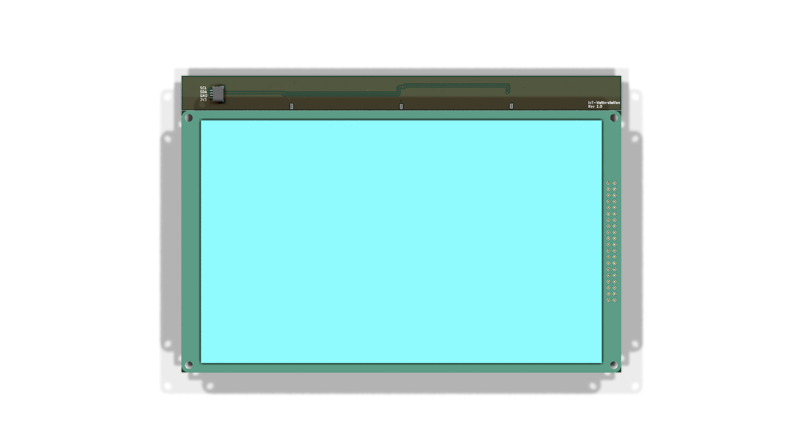
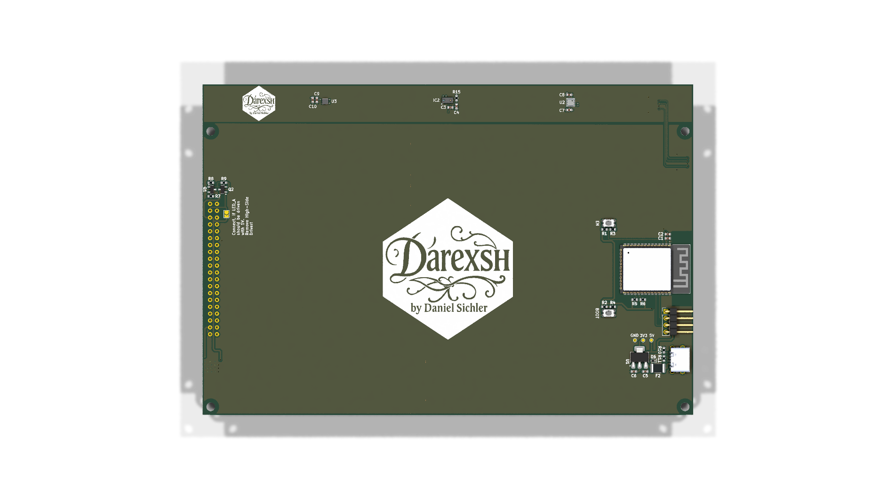
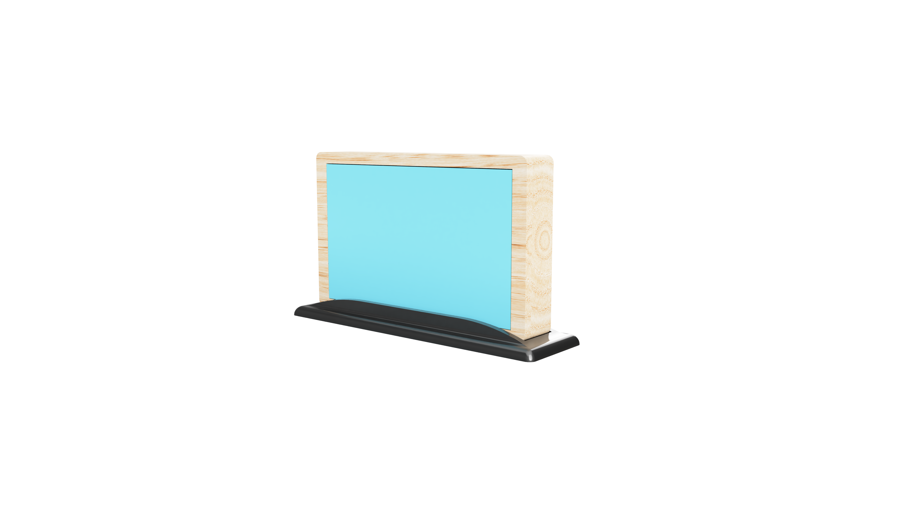

* * *

🌦️ ESP32-S3 Weather Station
============================

**A custom weather station with ESP32-S3, multiple sensors, and a 7" resistive TFT display**  
🖥️🌡️💧☀️🌐

  

* * *

✨ Authors
---------

| Name | GitHub | Role | Contact | Contributions |
| --- | --- | --- | --- | --- |
| **[Daniel Sichler aka Darexsh](https://github.com/Darexsh)** | [Link](https://github.com/Darexsh?tab=repositories) | Hardware & Firmware Development 🖥️🛠️, Display Integration 🎨 | 📧 [E-Mail](mailto:sichler.daniel@gmail.com) | Concept, Firmware, Display UI, Sensor Integration |

* * *

🚀 About the Project
--------------------

This project is a **custom weather station** based on the ESP32-S3 microcontroller. It combines multiple environmental sensors with a 7-inch resistive TFT display and a web interface to monitor data remotely and locally.

### 🛠️ Technologies

* **Microcontroller:** ESP32-S3
    
* **Sensors:** VCNL4040 (ambient light & proximity), BME688 (temperature, humidity, pressure, gas), LTR390-UV (UV index UVA/B)
    
* **Display:** 7" resistive TFT, connected via **DB0–DB7 (parallel interface)** with automatic brightness adjustment based on ambient light
    
* **Software:** C++, Arduino IDE / PlatformIO
    
* **Web Interface:** Hosted by ESP32-S3 for remote monitoring
    
* **Tools:** Git, Wireshark (optional for network debugging)
    

* * *

📋 Features
===========

* **🌡️ Environmental Measurements:** Temperature, humidity, pressure, air quality, ambient light, UV index
    
* **🖲️ Touchscreen Display:** 7" resistive TFT with local visualization of all sensor data
    
* **💡 Automatic Brightness:** Display dims based on ambient light from VCNL4040
    
* **🌐 Web Dashboard:** Access real-time sensor data remotely via a browser
    
* **📊 Historical Logging (optional):** Track trends for temperature, humidity, and UV exposure
    
* **⚡ Alerts & Automation (optional):** Configure thresholds for UV, temperature, and air quality
    

* * *

🔧 Hardware Setup
-----------------

* **ESP32-S3 microcontroller**
    
* **VCNL4040, BME688, LTR390-UV sensors** connected via I2C
    
* **7-inch resistive TFT touch display** connected via **DB0–DB7 (parallel interface)**
    
* Compatible **power supply** for ESP32-S3 and TFT display
    

* * *

🚀 Installation & Usage
-----------------------

1. Flash the firmware to ESP32-S3 using **Arduino IDE** or **PlatformIO** 💾
    
2. Connect sensors and display according to the wiring diagram 🔌
    
3. Power on the device 🔋
    
4. Access the **web dashboard** via Wi-Fi 🌐 to view sensor data in real-time
    
5. Use the touchscreen to navigate local measurements 🖲️
    

* * *

📜 License
----------

This project is licensed under the **MIT License** and was developed as an educational project. You are free to use, modify, and distribute the code and schematics as long as you credit the author:

**Copyright (c) 2025 Daniel Sichler aka Darexsh**

Please include the following notice with any use or distribution:

> Developed by Daniel Sichler aka Darexsh. Licensed under the MIT License. See `LICENSE` for details.

The full license is available in the [LICENSE](LICENSE) file.

* * *

<!-- Keep this line! Rendered picture of PCB is going to be displayed after Production files are pushed to branch! -->

 Created with ❤️ by Daniel Sichler 

